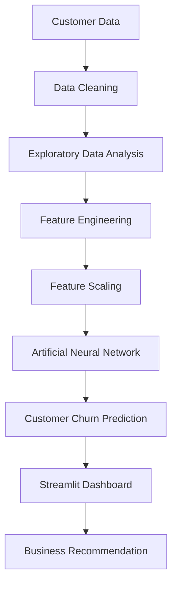

# European Bank Customer Churn Prediction using Artificial Neural Networks (ANN)

### Customer Engagement & Product Utilization Analytics for Retention Strategy

> Predict customer churn using Artificial Neural Networks (ANN) and visualize customer insights through an interactive Streamlit dashboard.

---


---

## Live Demo

🌐 https://bank-retention.streamlit.app/

# Project Overview

Customer churn is one of the biggest challenges in the banking industry. Retaining an existing customer is significantly more cost-effective than acquiring a new one.

This project leverages **Artificial Neural Networks (ANN)** to predict whether a customer is likely to leave the bank based on demographic information, financial behavior, and engagement metrics.

The project also includes a professional **Streamlit dashboard** that allows users to input customer details and receive real-time churn predictions along with risk analysis and AI-based recommendations.

---

# Business Problem

Banks often lose valuable customers because of:

- Low customer engagement
- Limited product utilization
- Inactive memberships
- Weak customer relationships

Instead of relying solely on demographic information, this project focuses on customer engagement and behavioral patterns to identify customers at risk of churning.

---

# Project Objectives

- Predict customer churn using ANN
- Identify high-risk customers
- Analyze customer engagement
- Improve retention strategies
- Support business decision-making through data analytics

---

# System Architecture



---

# Dataset Description

The dataset contains customer information collected from a European bank.

| Feature | Description |
|----------|-------------|
| CreditScore | Customer Credit Score |
| Geography | Customer Country |
| Gender | Male / Female |
| Age | Customer Age |
| Tenure | Years with Bank |
| Balance | Account Balance |
| NumOfProducts | Number of Products |
| HasCrCard | Credit Card Status |
| IsActiveMember | Active Membership |
| EstimatedSalary | Estimated Annual Salary |
| Exited | Target Variable |

Target Variable

```
0 → Customer Stays

1 → Customer Churns
```

---

# Machine Learning Workflow

```
Business Understanding

↓

Data Collection

↓

Data Cleaning

↓

Exploratory Data Analysis

↓

Feature Engineering

↓

Feature Scaling

↓

Artificial Neural Network

↓

Model Evaluation

↓

Model Deployment using Streamlit
```

---

# Exploratory Data Analysis (EDA)

Performed detailed analysis on:

- Missing Values
- Duplicate Records
- Data Types
- Target Variable Distribution
- Gender vs Churn
- Geography vs Churn
- Age vs Churn
- Balance vs Churn
- Credit Score vs Churn
- Active Member vs Churn
- Number of Products vs Churn

Key Findings:

- Older customers churn more frequently.
- Germany has the highest churn rate.
- Inactive members are more likely to churn.
- Customers with fewer banking products are at higher risk.
- Higher account balances alone do not guarantee customer retention.

---

# Artificial Neural Network Architecture

```
Input Layer
        │
        ▼
11 Neurons (ReLU)

        │
        ▼
7 Neurons (ReLU)

        │
        ▼
Dropout

        │
        ▼
6 Neurons (ReLU)

        │
        ▼
Dropout

        │
        ▼
Output Layer (Sigmoid)
```

---

# Model Configuration

| Parameter | Value |
|------------|--------|
| Algorithm | Artificial Neural Network |
| Optimizer | Adam |
| Loss Function | Binary Crossentropy |
| Activation | ReLU |
| Output Activation | Sigmoid |
| Task | Binary Classification |

---

# Streamlit Dashboard Features

The web application provides:

- Customer Information Form
- Real-Time Churn Prediction
- Churn Probability
- Risk Level Detection
- AI-Based Customer Recommendations
- Customer Summary Dashboard
- About Project Page
- Model Information Page

---

# Technologies Used

| Technology | Purpose |
|------------|----------|
| Python | Programming Language |
| Pandas | Data Analysis |
| NumPy | Numerical Computing |
| Matplotlib | Data Visualization |
| Seaborn | Statistical Visualization |
| Scikit-Learn | Data Preprocessing |
| TensorFlow | Deep Learning |
| Keras | ANN Development |
| Streamlit | Web Application |

---

# Project Structure

```
European-Bank-Customer-Churn-Prediction/

│

├── app.py

├── Customer_Churn_ANN.ipynb

├── Churn_Modelling.csv

├── european_bank.model.keras

├── scaler.pkl

├── requirements.txt

├── README.md

├── LICENSE

│

├── images/

│ ├── dashboard.png

│ ├── prediction.png

│ ├── eda1.png

│ └── eda2.png

│

└── .gitignore
```

---

# Installation

Clone the repository

```bash
git clone https://github.com/Chidatma/Customer-Churn-Prediction-ANN.git
```

Move into the project directory

```bash
cd Customer-Churn-Prediction-ANN
```

Install dependencies

```bash
pip install -r requirements.txt
```

---

# Run the Streamlit Application

```bash
streamlit run app.py
```

The dashboard will automatically open in your browser.

---

# Example Prediction Workflow

```
Enter Customer Details

↓

Click Predict

↓

ANN Model Processes Data

↓

Predict Churn Probability

↓

Display Risk Level

↓

Provide AI Recommendation
```

---

# Model Output

The application predicts:

- Customer Stay Probability
- Customer Churn Probability
- Risk Category
- Personalized Business Recommendation

---

# Business Insights

The model helps banks:

- Reduce customer churn
- Improve customer engagement
- Identify high-value customers
- Increase product utilization
- Improve customer satisfaction
- Support retention campaigns

---

# Future Improvements

- Hyperparameter Tuning
- Cross Validation
- Explainable AI (SHAP)
- Model Monitoring
- Cloud Deployment
- Database Integration
- Authentication System
- Customer Segmentation
- Admin Dashboard
- Real-Time Data Pipeline

---

# Results

Successfully built a complete end-to-end Machine Learning project including:

- Data Cleaning
- Exploratory Data Analysis
- Feature Engineering
- Artificial Neural Network
- Model Evaluation
- Streamlit Deployment

---

# Learning Outcomes

Through this project, I gained practical experience in:

- Business Problem Understanding
- Data Analysis
- Feature Engineering
- Deep Learning
- Artificial Neural Networks
- TensorFlow
- Streamlit Deployment
- Model Serialization
- End-to-End Machine Learning Pipeline

---

# Author

**Chidatma Patel**

Machine Learning Enthusiast

LinkedIn

https://www.linkedin.com/in/chidatmapatel2007

GitHub

https://github.com/Chidatma

Email

patelchidatma@gmail.com

---

# License

This project is licensed under the MIT License.

---

⭐ If you found this project helpful, consider giving it a **Star** on GitHub!
